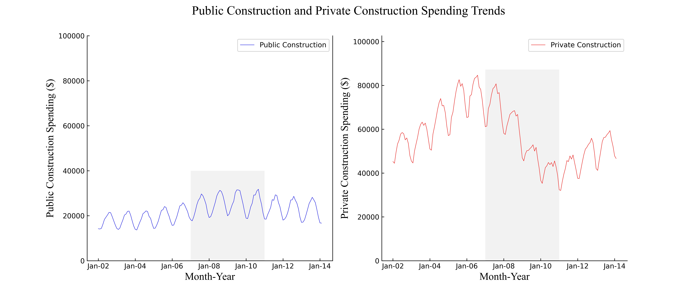

This is content I have developed for my courses:

[Extra Graphs for M3 Advanced Graphing Assignment](/timeseries/index.md)

This is a link to the Pitch Arsenal Repository for the work related to that project.
-[Link to Pitch Arsenal Work](https://github.com/TJSWLWM/TJSWLWM.github.io/tree/main/PitchArsenals)
